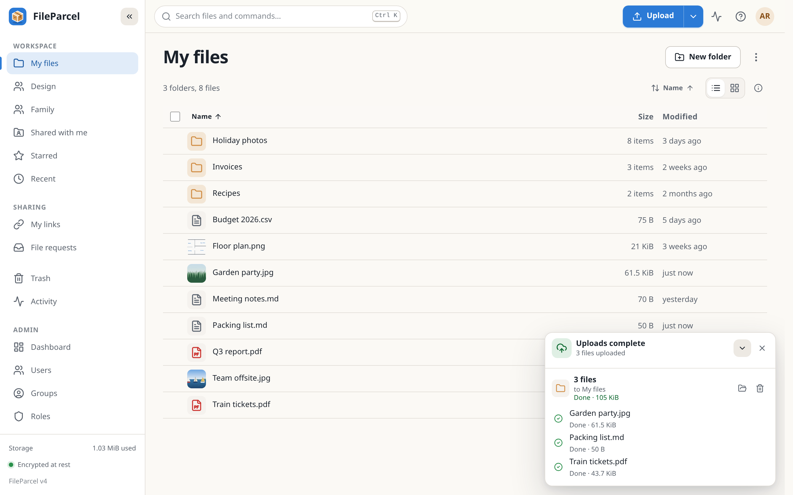
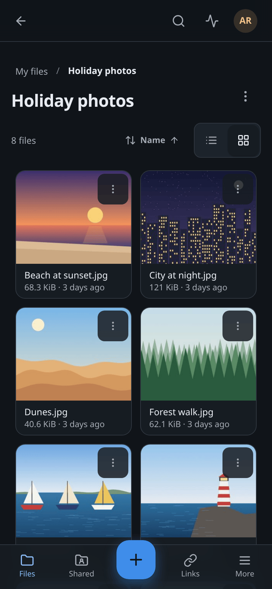
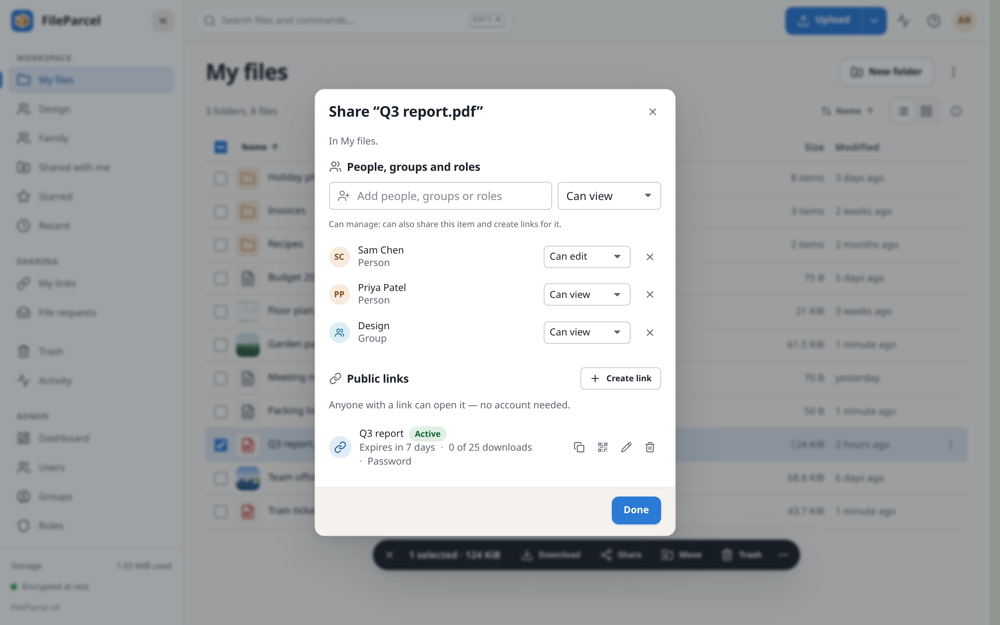
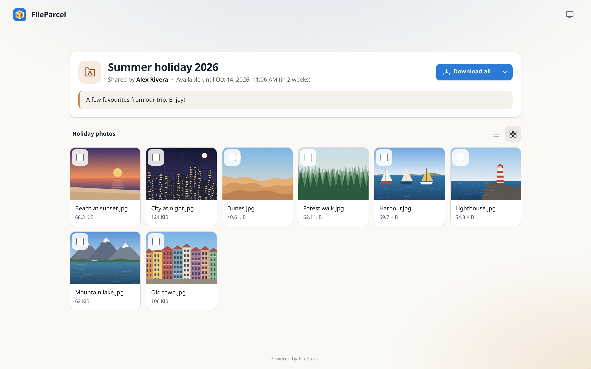
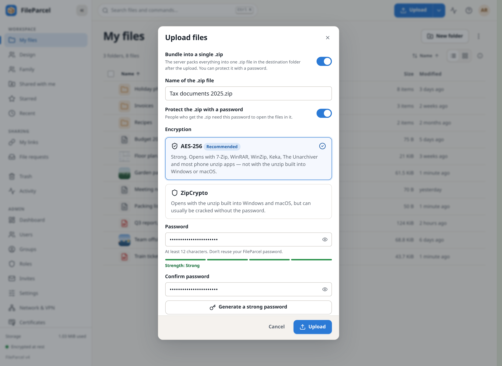
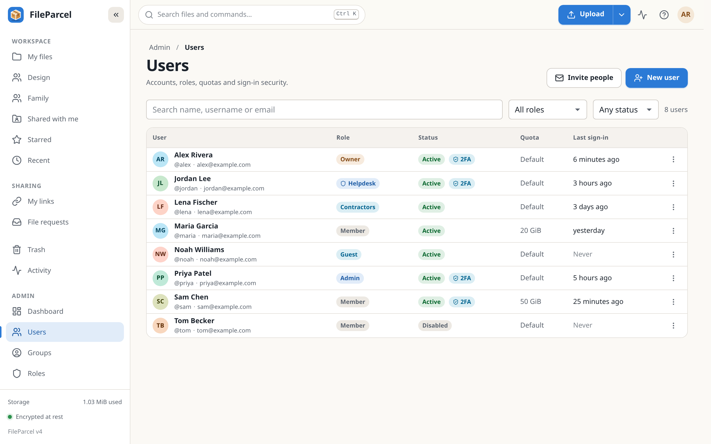
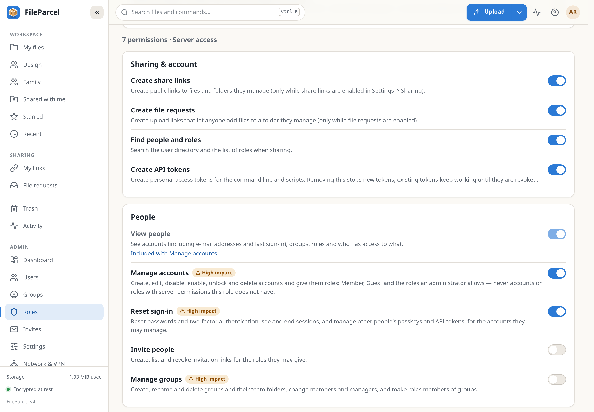
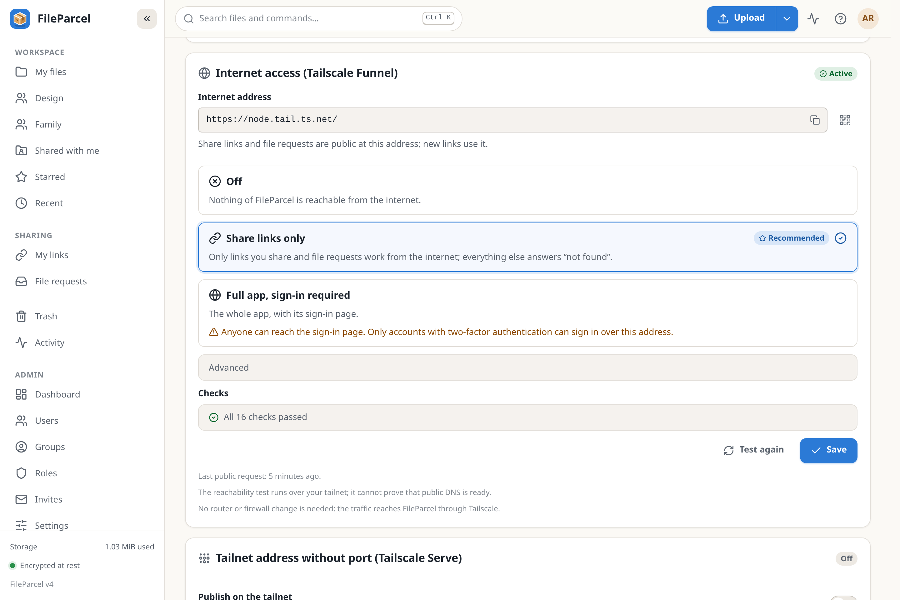

# FileParcel

**Self-hosted, encrypted file sharing for your home or small office — one program, one folder.**

[Download](https://github.com/kpdirectmail/fileparcel/releases/latest) ·
[Install guide](docs/INSTALL.md) · [User manual](docs/FILEPARCEL.md) · [Commands](docs/COMMANDS.md) ·
[Report a bug](https://github.com/kpdirectmail/fileparcel/issues/new/choose) ·
[Security](docs/SECURITY.md)

FileParcel turns a Linux box, a Raspberry Pi or a Mac into a private place for your files. Everyone you
give an account gets their own space, groups get team folders, and you can share with a link that has a
password and an end date. Files are encrypted on disk, the connection is always HTTPS, and nothing is on
the internet unless you switch it on. It works in any modern browser on phones and computers, and
everything can also be done from the command line.

## Features

- **Files and folders**: your own "My files", a team folder per group, drag and drop, previews, versions,
  trash and search.
- **Sharing**: with people, groups and roles, or with a link that has a password, an end date and a QR code.
- **File requests**: people without an account can upload files to you.
- **Roles and permissions**: the built-in Owner, Admin, Member and Guest roles, plus roles of your own, for
  example a helpdesk that may reset passwords, with access to folders and groups.
- **Password-protected .zip on upload**: bundle an upload into one `.zip` locked with a password (AES-256
  or ZipCrypto).
- **Encrypted on disk**: files, thumbnails and backups ([how](docs/ENCRYPTION.md)).
- **Private by default**: only your home network and your VPN can connect, always over HTTPS; two-factor
  sign-in is required for administrators ([security](docs/SECURITY.md)).
- **Easy on a home network**: it announces `fileparcel.local` and prints every address with a QR code.
- **VPNs and Tailscale**: it recognises Tailscale, Headscale, WireGuard, ZeroTier, NetBird, NordVPN Meshnet
  and more; Tailscale Funnel can put just your share links on the internet without opening a port on your
  router, and Tailscale Serve gives your tailnet an address without a port. Both are off until you switch
  them on.
- **Backups built in**: encrypted, on a schedule, restored with one command.
- **One program, one folder**: for Linux (PC, ARM, every Raspberry Pi from the Pi 2 on), macOS or Docker;
  upgrades roll back by themselves if something goes wrong.

The [user manual](docs/FILEPARCEL.md) describes every feature in detail.

## Quick install

FileParcel runs on Linux (64-bit PC, 64-bit ARM and ARMv7, including the Raspberry Pi 2 and newer) and
macOS (Intel and Apple silicon); on Windows, use Docker Desktop or WSL 2.

From the [latest release](https://github.com/kpdirectmail/fileparcel/releases/latest), download
`fileparcel-v1.zip` and its checksum file `fileparcel-v1.zip.sha256` into one folder, then:

```sh
sha256sum -c fileparcel-v1.zip.sha256    # check the download (macOS: shasum -a 256 -c fileparcel-v1.zip.sha256)
unzip fileparcel-v1.zip && cd fileparcel-v1
./install.sh                             # asks a few questions; ./install.sh -y takes all the defaults
```

No `sudo` needed. The installer checks and installs the right program for your machine into
`~/.local/share/fileparcel` (macOS: `~/Library/Application Support/FileParcel`), starts it as a
background service and prints the addresses (with QR codes), the certificate fingerprint, the admin
password and the backup identity. **Save the password and the backup identity: they are shown only
once.** A Raspberry Pi, a system service, Docker, every option and uninstalling: see
[Installing FileParcel](docs/INSTALL.md).

## First steps

1. Run the firewall commands the installer printed, if it printed any.
2. On each device, open `https://<server>:8443/trust` and trust FileParcel's certificate
   ([how](docs/INSTALL.md#trust-fileparcels-certificate-on-your-devices)).
3. Sign in as `admin` with the printed password, choose a new one and set up two-factor authentication.
4. Invite people (Admin → Invites, or `fileparcel invite create --qr`) and create groups for team folders.
5. Run `fileparcel doctor` once: it tells you what is left to do.

## Screenshots

<!-- How these are made: the PNGs in docs/images/ are committed by hand. They were taken with
     Playwright's Chromium (tests/ui/.venv) against a scratch server started the way tests/ui/conftest.py
     starts one, with a binary built by "sh scripts/build.sh -v v1 host" and the fake tailscaled from
     tests/ui/fake_tailscaled.py (so the Funnel card has something to show). The server was filled with
     made-up people (Alex Rivera, Sam Chen, ...) and generated pictures: no real data. Desktop pages are
     1440 px wide (900 px high, taller where the page needs it), the phone is 390x844 in dark mode, all at
     device scale factor 2, then reduced to 256 colours with Pillow (libimagequant) to stay under about
     400 KB each. The UI tests write fresh screenshots to tests/ui/screenshots/ (gitignored) on every run,
     but they do not update these: retake them by hand when the UI changes. -->

| Your files and the upload queue | On a phone, in dark mode |
|---|---|
|  |  |

| Share with people and groups | A public share page | Upload as a password-protected .zip |
|---|---|---|
|  |  |  |

| Admin → Users | Admin → Roles | Admin → Network & VPN |
|---|---|---|
|  |  |  |

## Everyday commands

```sh
fileparcel status                                    # is the server running, and at which addresses?
fileparcel open --qr                                 # the addresses, with a QR code for your phone
fileparcel user create sam --generate-password       # add an account (the password is shown once)
fileparcel invite create --qr                        # a sign-up link someone can scan
fileparcel files put ./photos "/My files"            # upload a folder
fileparcel share create "/My files/photos" --expires 7d --qr    # share it with a link for a week
fileparcel access grant /Team/Design --group Marketing          # let another group see a team folder
fileparcel backup create --wait                      # back up everything now
fileparcel doctor --fix                              # find and fix problems
fileparcel help                                      # every command, grouped, with common tasks
```

Every command, step-by-step recipes and the full reference: [The fileparcel command](docs/COMMANDS.md).

## Upgrading

Download the new release, then run its `./install.sh` (it finds your installation and upgrades it in
place) or `fileparcel upgrade fileparcel-vN.zip`. Both make a backup first and put the previous version back
by themselves if the new one does not start. Read the release notes and
[Before you upgrade](docs/INSTALL.md#before-you-upgrade) first; rolling back by hand and Docker are covered
in [Upgrade to a new version](docs/INSTALL.md#upgrade-to-a-new-version).

## Uninstalling

```sh
~/.local/share/fileparcel/uninstall.sh      # removes the service and the command; your data stays
```

`--purge` deletes everything; see [Uninstall FileParcel](docs/INSTALL.md#uninstall-fileparcel).

## Documentation

| Document | What is in it |
|---|---|
| [Installing FileParcel](docs/INSTALL.md) | Install on Linux, a Raspberry Pi, a Mac or in Docker; firewall, certificates and the first sign-in; VPNs and Tailscale Funnel; upgrading, moving and uninstalling |
| [The fileparcel command](docs/COMMANDS.md) | Every command with examples, recipes for common tasks, renamed commands and the full reference |
| [User manual](docs/FILEPARCEL.md) | Using and running FileParcel: files, sharing, roles, network, certificates, encryption, backups, every setting and a troubleshooting FAQ |
| [Security](docs/SECURITY.md) | Threat model, controls, hardening checklist and how to report a vulnerability |
| [Encryption](docs/ENCRYPTION.md) | The at-rest formats and key hierarchy, for auditors |
| [Third-party software](docs/THIRD_PARTY.md) | Every component with its version and license |
| [Contributing](CONTRIBUTING.md) | How to report a bug, suggest a feature or send a change |
| [Development](docs/DEVELOPMENT.md) | For contributors: setting up, building, testing and the rules the code follows |
| [Design](docs/DESIGN.md) | For contributors: architecture, database schema, HTTP API and the decisions behind them |

## Building from source

You need Go 1.26 or newer (`scripts/get-go.sh` installs one into `~/sdk`, checksum-verified) and `git`.

```sh
git clone https://github.com/kpdirectmail/fileparcel
cd fileparcel
scripts/get-go.sh 1.27.1    # optional: get Go
make build                  # bin/fileparcel for this machine
make test                   # the Go tests (make lint, make e2e and make ui run more)
make dev                    # a dev server on https://127.0.0.1:18443 with a scratch home
make cross                  # dist/fileparcel-<os>-<arch> for all five release targets
./install.sh                # install from the checkout (it builds first)
```

More in [Development](docs/DEVELOPMENT.md) and [Contributing](CONTRIBUTING.md).

## Getting help and reporting problems

- **Questions and problems**: start with `fileparcel doctor` and the
  [troubleshooting FAQ](docs/FILEPARCEL.md#troubleshooting-and-faq).
- **Report a bug** or **request a feature**:
  [open an issue](https://github.com/kpdirectmail/fileparcel/issues/new/choose). For a bug, include
  `fileparcel version` and `fileparcel doctor` output (remove names and addresses you do not want to
  publish).
- **Security issues: report privately**, never in a public issue:
  [report a vulnerability](https://github.com/kpdirectmail/fileparcel/security/advisories/new). See
  [Reporting a vulnerability](docs/SECURITY.md#reporting-a-vulnerability) for what to include.

## License

FileParcel is licensed under the [Apache License, Version 2.0](LICENSE). Copyright 2026 The FileParcel
Authors. It includes third-party software under its own licenses; see [NOTICE](NOTICE) and
[docs/THIRD_PARTY.md](docs/THIRD_PARTY.md).
